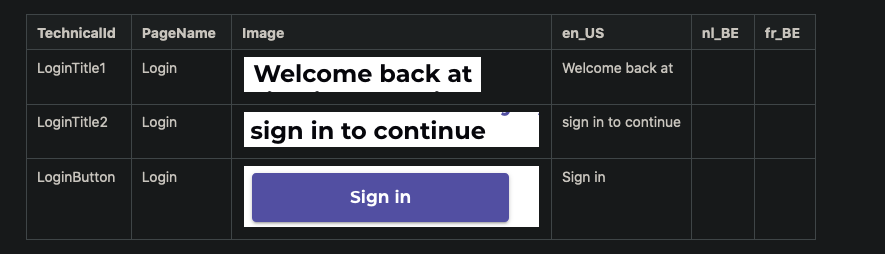

# confluence-i18n-importer

### Information
CLI tool to parse a Confluence page with a table containing translations to JSON files that can be used with 
[i18next](https://www.i18next.com/).

A blog article explaining how and why we use this tool at AppFoundry can be found on [our blog](https://appfoundry.be/blog/automating-the-copy-experience-for-our-customers).

Confluence table structure example:



Any column not named TechnicalId, PageName or Image will be seen as a language.

Install: `$ npm install -g confluence-i18n-importer`

Example usage: `$ confluence-i18n-importer -d CONFLUENCE_BASE_URL -i PAGE_ID -u USERNAME -p PASSWORD  -o "/Users/john/Projects/xxxx/translations"`

The i18n files are outputted by default in the directory where the command is ran from when the output flag is not given.

### Options

- '-d': Domain of the Confluence page. Example 'https://confluence.yourcompany.com'
- '-i': Page id of the confluence page to be parsed. If you want the page ID, go to Tools —> Page Information on the particular page you are interested in. You should see the page (content) ID shown in the URL when you do this.
- '-u': The username of the confluence account.
- '-p': Password or API token of the confluence account. API tokens are only avaiable on cloud hosted Atlassasian stacks.
- '-t': When this flag is given the output files will have the TypeScript (.ts) extension.
- '-o': Output directory for i18n files. Remeber to quote the path if there's spaces in the path. The directory already has to exist. Default the directory when the command is ran from.

### Using locally

#### Install

`$ npm install`

#### Linking package

`$ npm link`

#### Using the package

`$ npm run build && confluence-i18n-importer -d CONFLUENCE_BASE_URL -i PAGE_ID -u USERNAME -p PASSWORD`

#### Example output

Files: `en_US.js, fr_BE.js, nl_BE.js`

```javascript
export default {
  LoginTitle1: `Welcome back at`,
  LoginTitle2: `sign in to continue`,
  LoginButton: `Sign in`,
};
```